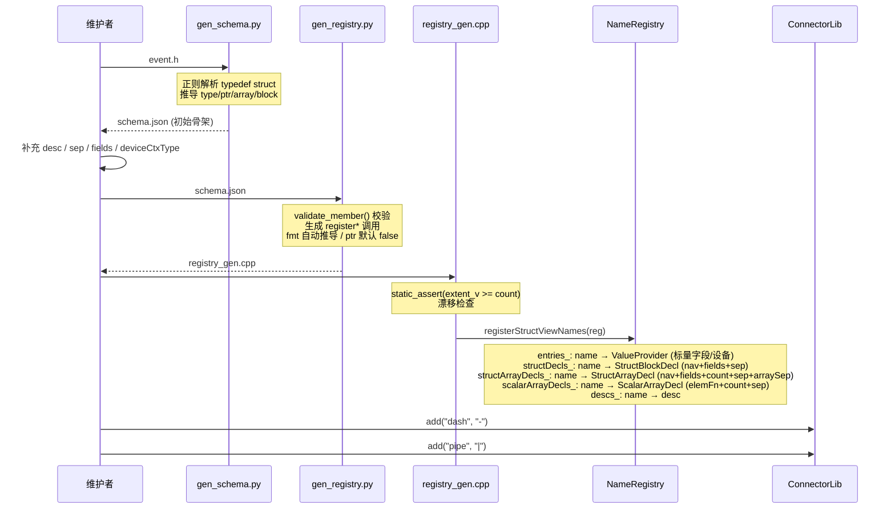
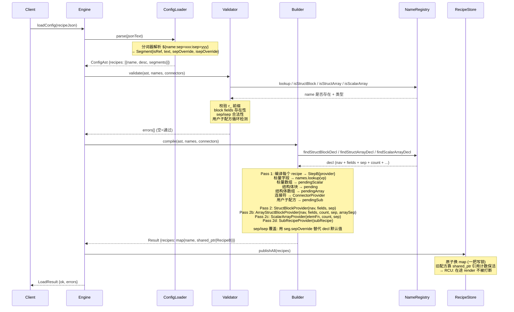
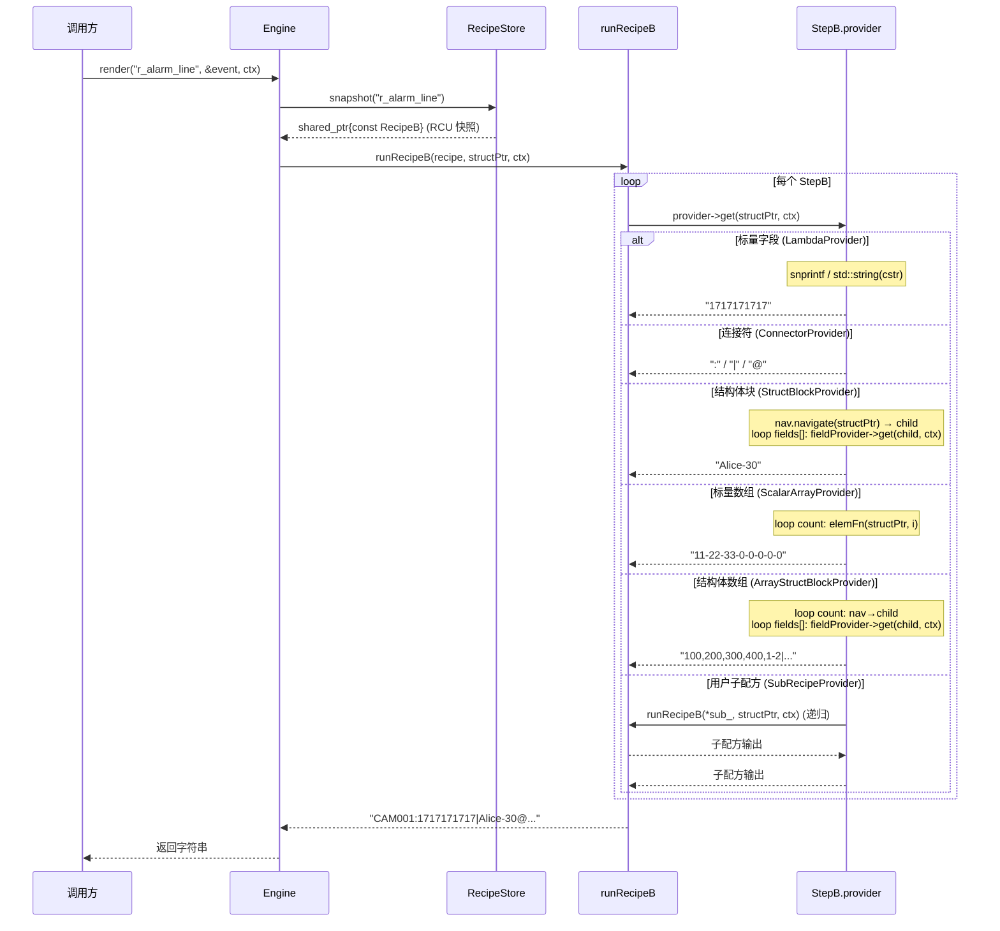
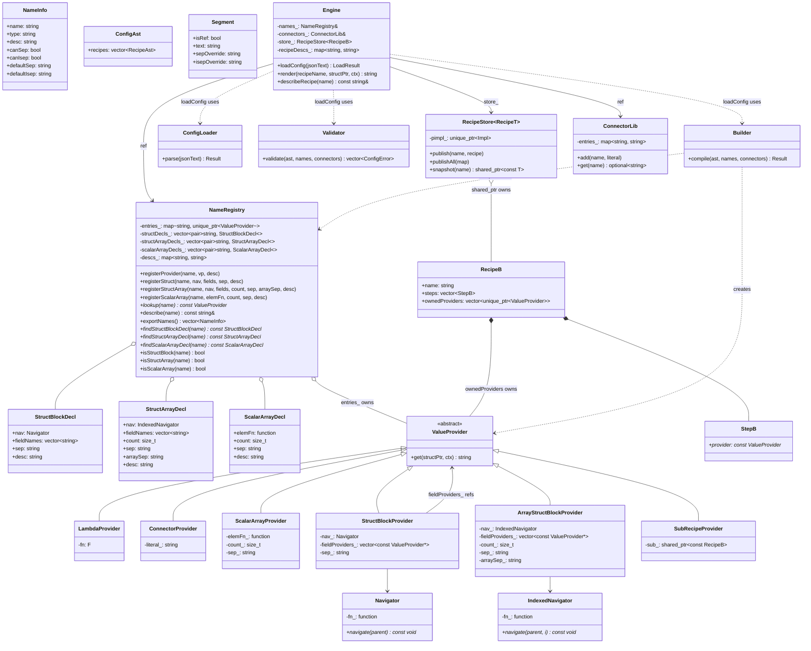
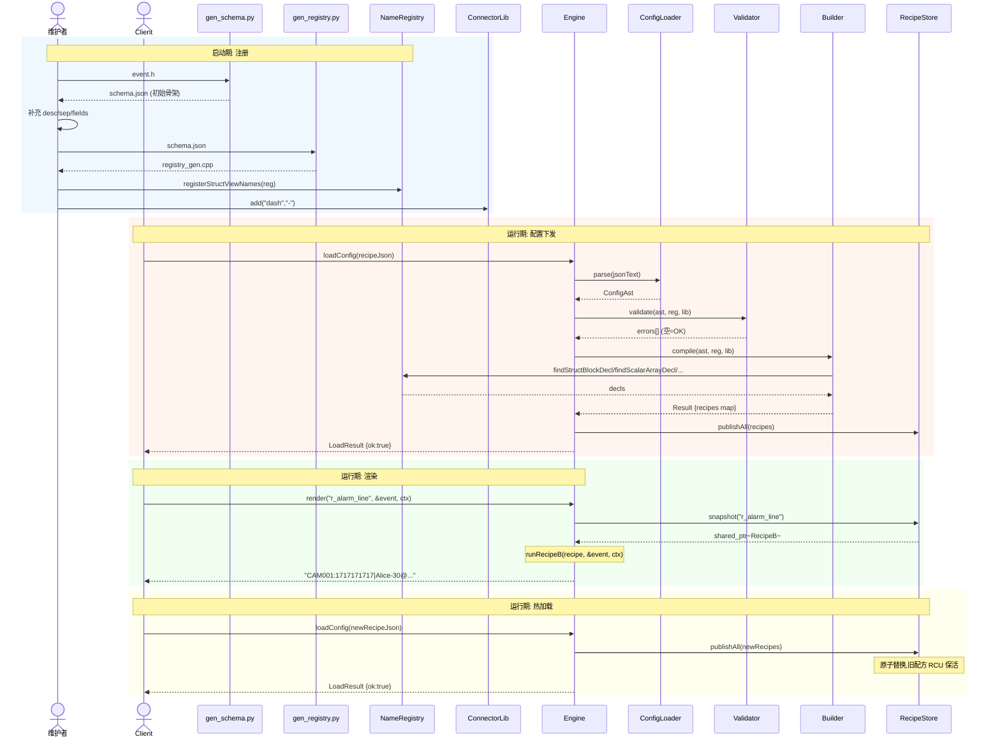

# struct_view 核心逻辑 UML (Mermaid)

> 用 Mermaid 语法,可在 GitHub/IDE 直接渲染,无需 PlantUML 服务器。

## 1. 注册流程(启动期):schema → codegen → NameRegistry

## 2. 配置流程(运行期 loadConfig):recipe JSON → Engine → RecipeStore

## 3. 渲染流程(热路径):render → RecipeStore snapshot → runRecipeB

## 4. 类图:核心类型关系

## 5. 完整时序图:注册 + 配置 + 渲染 + 热加载

