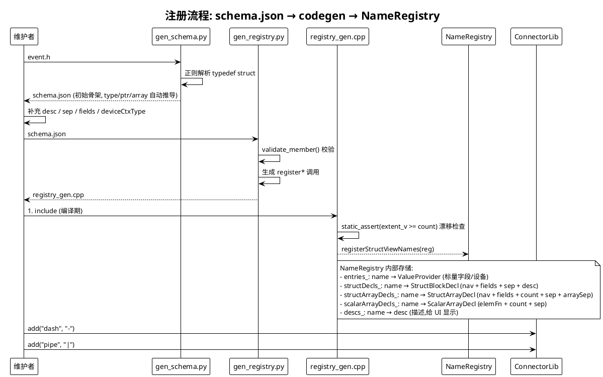
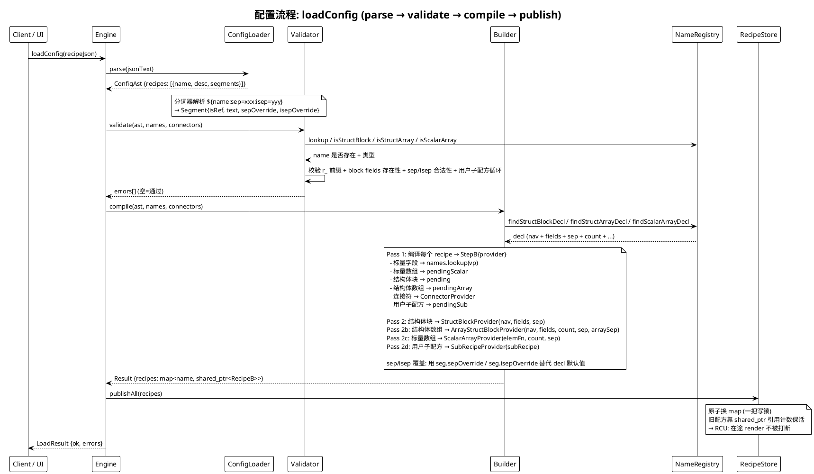
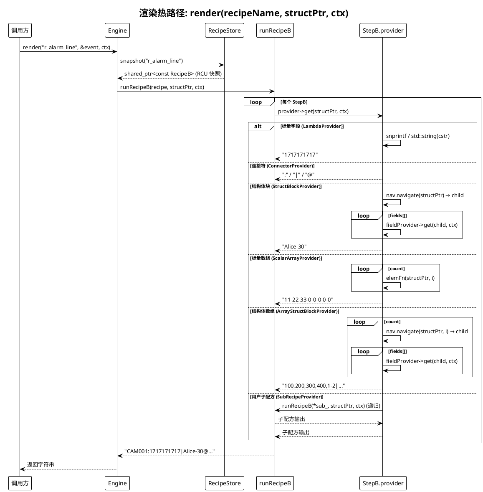
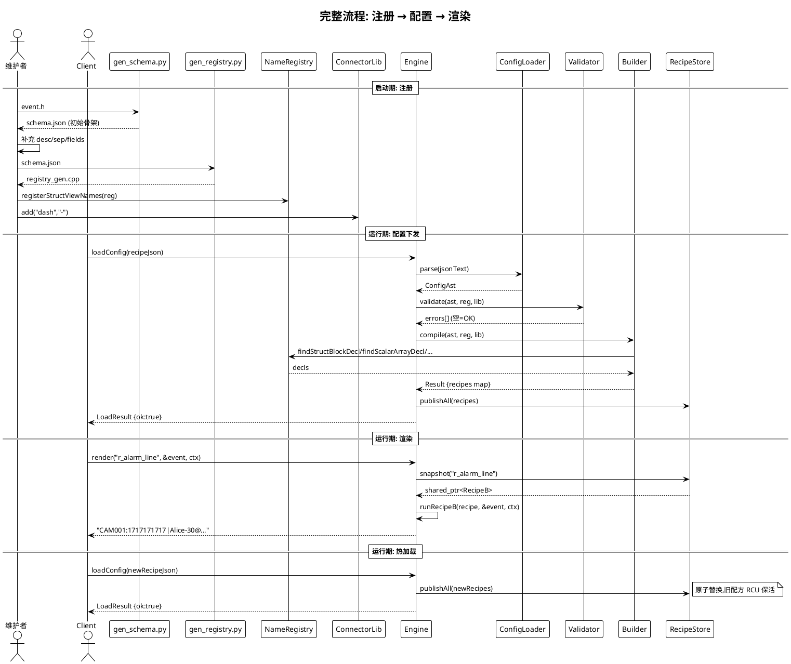

# struct_view 核心逻辑 UML

> 用 PlantUML 语法描述。可用 [PlantUML 在线渲染器](http://www.plantuml.com/plantuml/) 或 VS Code PlantUML 插件查看。

## 1. 注册流程(启动期):schema → codegen → NameRegistry

## 2. 配置流程(运行期 loadConfig):recipe JSON → Engine → RecipeStore

## 3. 渲染流程(热路径):render → RecipeStore snapshot → runRecipeB

## 4. 类图:核心类型关系

```plantuml
@startuml
!theme plain
title 核心类图

package "注册表" {
  class NameRegistry {
    - entries_: map<string, unique_ptr<ValueProvider>>
    - structDecls_: vector<pair<string, StructBlockDecl>>
    - structArrayDecls_: vector<pair<string, StructArrayDecl>>
    - scalarArrayDecls_: vector<pair<string, ScalarArrayDecl>>
    - descs_: map<string, string>
    + registerProvider(name, vp, desc)
    + registerStruct(name, nav, fields, sep, desc)
    + registerStructArray(name, nav, fields, count, sep, arraySep, desc)
    + registerScalarArray(name, elemFn, count, sep, desc)
    + lookup(name): const ValueProvider*
    + describe(name): const string&
    + exportNames(): vector<NameInfo>
    + findStructBlockDecl / findStructArrayDecl / findScalarArrayDecl
    + isStructBlock / isStructArray / isScalarArray
  }

  class StructBlockDecl {
    + nav: Navigator
    + fieldNames: vector<string>
    + sep: string
    + desc: string
  }

  class StructArrayDecl {
    + nav: IndexedNavigator
    + fieldNames: vector<string>
    + count: size_t
    + sep: string
    + arraySep: string
    + desc: string
  }

  class ScalarArrayDecl {
    + elemFn: function<string(const void*, size_t)>
    + count: size_t
    + sep: string
    + desc: string
  }

  class NameInfo {
    + name: string
    + type: string
    + desc: string
    + canSep: bool
    + canIsep: bool
    + defaultSep: string
    + defaultIsep: string
  }
}

package "ValueProvider 层次" {
  abstract class ValueProvider {
    + get(structPtr, ctx): string
  }

  class LambdaProvider {
    - fn: F
  }

  class ConnectorProvider {
    - literal_: string
  }

  class ScalarArrayProvider {
    - elemFn_: function
    - count_: size_t
    - sep_: string
  }

  class StructBlockProvider {
    - nav_: Navigator
    - fieldProviders_: vector<const ValueProvider*>
    - sep_: string
  }

  class ArrayStructBlockProvider {
    - nav_: IndexedNavigator
    - fieldProviders_: vector<const ValueProvider*>
    - count_: size_t
    - sep_: string
    - arraySep_: string
  }

  class SubRecipeProvider {
    - sub_: shared_ptr<const RecipeB>
  }

  ValueProvider <|-- LambdaProvider
  ValueProvider <|-- ConnectorProvider
  ValueProvider <|-- ScalarArrayProvider
  ValueProvider <|-- StructBlockProvider
  ValueProvider <|-- ArrayStructBlockProvider
  ValueProvider <|-- SubRecipeProvider
}

package "导航器" {
  class Navigator {
    - fn_: const void*(*)(const void*)
    + navigate(parent): const void*
  }
  class IndexedNavigator {
    - fn_: const void*(*)(const void*, size_t)
    + navigate(parent, i): const void*
  }
}

package "Recipe" {
  class StepB {
    + provider: const ValueProvider*
  }
  class RecipeB {
    + name: string
    + steps: vector<StepB>
    + ownedProviders: vector<unique_ptr<ValueProvider>>
  }
  class RecipeStore<T> {
    - pimpl_: unique_ptr<Impl>
    + publish(name, recipe)
    + publishAll(map)
    + snapshot(name): shared_ptr<const T>
  }
}

package "配置流水线" {
  class ConfigLoader {
    + parse(jsonText): Result {ok, parseError, ast}
  }
  class ConfigAst {
    + recipes: vector<RecipeAst>
  }
  class RecipeAst {
    + name: string
    + desc: string
    + segments: vector<Segment>
  }
  class Segment {
    + isRef: bool
    + text: string
    + sepOverride: string
    + isepOverride: string
  }
  class Validator {
    + validate(ast, names, connectors): vector<ConfigError>
  }
  class Builder {
    + compile(ast, names, connectors): Result {ok, errors, recipes}
  }
}

package "Engine" {
  class Engine {
    - names_: NameRegistry&
    - connectors_: ConnectorLib&
    - store_: RecipeStore<RecipeB>
    - recipeDescs_: map<string, string>
    + loadConfig(jsonText): LoadResult
    + render(recipeName, structPtr, ctx): string
    + describeRecipe(name): const string&
  }
  class ConnectorLib {
    - entries_: map<string, string>
    + add(name, literal)
    + get(name): optional<string>
  }
}

NameRegistry o-- ValueProvider : entries_ owns
NameRegistry o-- StructBlockDecl
NameRegistry o-- StructArrayDecl
NameRegistry o-- ScalarArrayDecl
StructBlockProvider --> Navigator
ArrayStructBlockProvider --> IndexedNavigator
StructBlockProvider --> ValueProvider : fieldProviders_ references
RecipeB *-- StepB
RecipeB *-- ValueProvider : ownedProviders owns
Engine --> NameRegistry : ref
Engine --> ConnectorLib : ref
Engine --> RecipeStore : store_
Engine ..> ConfigLoader : loadConfig uses
Engine ..> Validator : loadConfig uses
Engine ..> Builder : loadConfig uses
Builder ..> NameRegistry : compile reads
Builder ..> ValueProvider : creates
RecipeStore o-- RecipeB : shared_ptr owns

@enduml
```

## 5. 时序图:完整流程(注册 + 配置 + 渲染)

